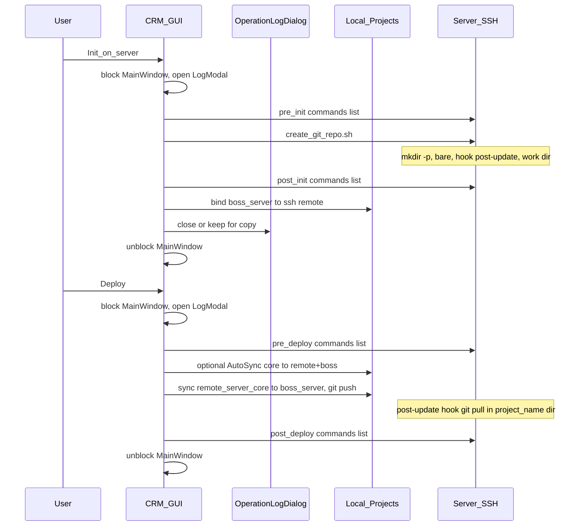
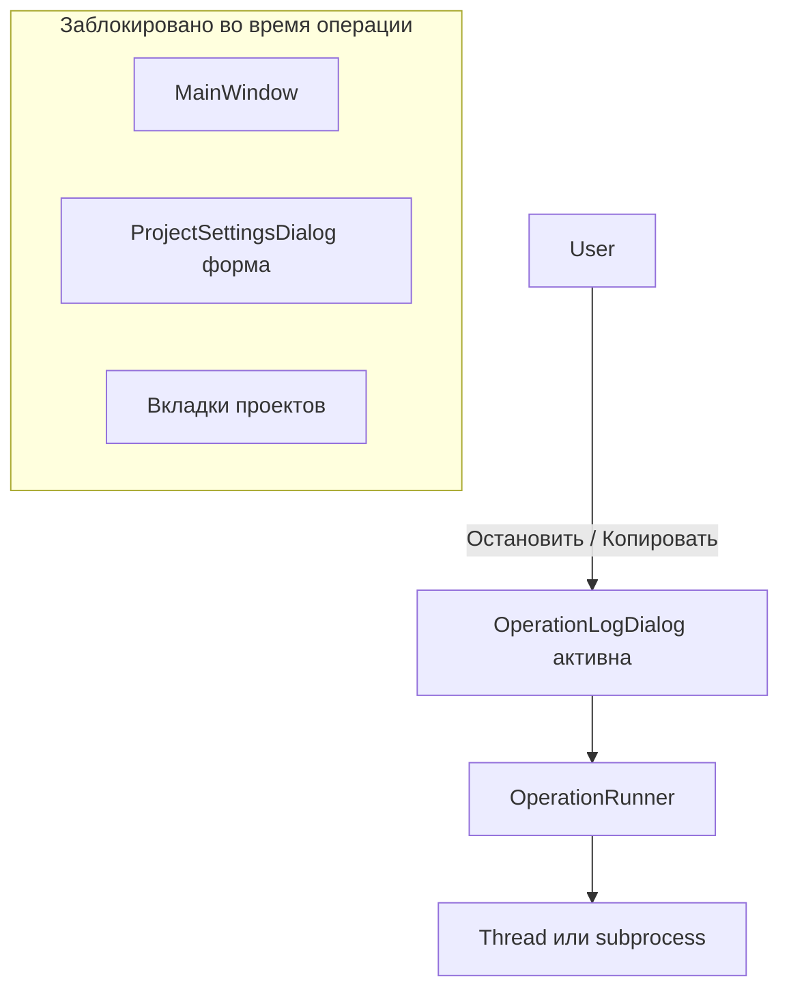

# План реализации: remote git (как старый скрипт), настройки в модалке, Clone/FromCoreToRemote, единый стиль

Документ для согласования перед кодированием. Основан на запросе пользователя и уточнениях (май 2026).

---

## Целевая картина



| Слой | Локально (`Projects/<id>/`) | На сервере (`MY_MAIN_PATH/`) |
|------|-----------------------------|------------------------------|
| Полный код | `project_core/` | — |
| Канон выкладки | `remote_server_core/` | — |
| Git push | `boss_server/` → remote | `<project_name>.git` (bare) |
| Авто-pull после push | — | `<project_name>/` (hook) |

Имена на сервере — **как в старом скрипте**: bare `{project_name}.git`, рабочая копия `{project_name}` (не `boss_server` на VPS). Локальная папка по-прежнему **`boss_server`**.

---

## Блок 1. `create_git_repo.sh` — логика как в [`scripts/create_git_repo.sh`](scripts/create_git_repo.sh)

### 1.1 Что меняем

- **Убрать** текущий упрощённый шаблон из [`crm/project_init.py`](crm/project_init.py) (`git init --bare` без hook).
- **Вернуть** поведение старого скрипта: `git init` + `git --bare init`, hook **`post-update`** с `cd $MY_MAIN_PATH/$PROJECT_NAME && git pull <alias> master`, `core.bare true`, `chmod 777`, начальный commit в рабочей копии и `git push`.
- **Параметризация** (передаются при запуске, не хардкод `/root/arbitrage/`):
  - `MY_MAIN_PATH` — базовый каталог на сервере (аналог `my_main_path`).
  - `PROJECT_NAME` — имя bare (`$PROJECT_NAME.git`) и рабочей папки (`$PROJECT_NAME`).
  - Опционально: `GIT_BRANCH` (по умолчанию `master`), `REMOTE_ALIAS` (по умолчанию = `PROJECT_NAME`, как `arbitrage` в старом скрипте).

### 1.2 `mkdir -p`

В начале скрипта:

```sh
mkdir -p "$MY_MAIN_PATH"
cd "$MY_MAIN_PATH" || exit 1
```

Далее `mkdir` для `$PROJECT_NAME.git` и `$PROJECT_NAME` — как в старом файле (без `-p` на вложенных, если родитель уже создан).

### 1.3 Канон в репозитории

- Обновить [`scripts/create_git_repo.sh`](scripts/create_git_repo.sh) до параметризованной версии (шаблон с `$MY_MAIN_PATH` / `$PROJECT_NAME`).
- Генерация в `Projects/<id>/create_git_repo.sh` — **тот же текст**, подставляя `project_id` как значение по умолчанию в комментариях.

### 1.4 Деплой в CRM — отказ от `git pull` по SSH

Сейчас [`build_ssh_remote_command`](crm/config_store.py) делает `git pull` на сервере. После hook это **лишнее**.

- **Новая модель (согласовано):** одна кнопка **«Деплой»** = цепочка:
  1. `pre_deploy_commands` (список, по SSH, по очереди)
  2. при включённом **Auto Sync** — копирование выбранных путей `project_core` → `remote_server_core` и `boss_server`
  3. локально: `sync_remote_core_to_boss` + `git push` (как сейчас Sync)
  4. на сервере: срабатывает **post-update** (pull в `$MY_MAIN_PATH/$PROJECT_NAME`)
  5. `post_deploy_commands` (список, по SSH; сюда же `systemctl restart`, `pm2`, nginx и т.д.)

- Кнопки **Sync** и **SSH: pull + restart** убрать или заменить одной **Деплой** (рекомендация: одна кнопка; вывод — в **модалке лога**, см. блок 8).

---

## Блок 8. Модальное окно лога операций + блокировка GUI + остановка

Независимый компонент GUI для **любой длительной операции**: clone, инициализация на сервере, деплой, отдельные SSH/терминальные команды (в т.ч. элементы из списков pre/post), привязка `boss_server`, ручное «Применить к remote» и т.д.

### 8.1 Компоненты (новые модули)

| Модуль / класс | Назначение |
|----------------|------------|
| [`crm/gui/operation_log_dialog.py`](crm/gui/operation_log_dialog.py) | `OperationLogDialog` — модальное окно с логом |
| [`crm/gui/operation_runner.py`](crm/gui/operation_runner.py) | Единая точка запуска: блокировка главного окна, один активный job, отмена |
| (опционально) расширение [`OpWorker`](crm/gui/project_settings_core.py) | Перенести/обобщить в `CancellableWorker` с флагом `cancel_requested` |

**`OperationLogDialog`** (отдельно от модалки настроек ⚙):

- Заголовок операции (например «Инициализация remote git», «Деплой», «Clone»).
- `QPlainTextEdit` **только чтение**, моноширинный шрифт, тёмная тема из [`theme.py`](crm/gui/theme.py).
- Потоковое дополнение лога (`append_log(line, level=info|error)`) из worker-потока через **сигналы** Qt (не писать в виджет из фонового потока напрямую).
- Кнопки:
  - **Копировать всё** — `QApplication.clipboard()`, весь текст лога (удобно для анализа ошибок).
  - **Копировать выделение** (опционально, если есть выделение) — стандартное поведение Ctrl+C тоже оставить.
  - **Остановить** — запрос отмены текущего процесса (см. 8.3); пока идёт отмена — disabled «Закрыть» или отдельный статус «Останавливаем…».
  - **Закрыть** — доступна после завершения/отмены/ошибки; во время выполнения — либо скрыта, либо закрытие = тот же «Остановить» (предлагается: **не закрывать** без остановки или завершения, чтобы лог не потерять).

**Не дублировать** встроенный `QTextEdit` лога в модалке настроек: настройки ⚙ — форма и кнопки; весь ход операции — только в `OperationLogDialog`.

### 8.2 Блокировка главного окна

Пока выполняется **любая** операция через `OperationRunner`:

1. **Один активный job** глобально на приложение (второй Clone/Деплой/Init — не стартовать; кнопки в UI disabled или `QMessageBox` «Уже выполняется операция …»).
2. **Блокировка `MainWindow`**:
   - `main_window.setEnabled(False)` **или** полупрозрачный overlay поверх central widget (визуально понятнее);
   - модалка лога и (если открыта) та же сессия — **остаются активными** (`OperationLogDialog` — отдельное модальное окно поверх, с `WindowModality` не блокирующим лог, но блокирующим остальное).
3. Модалка **настроек проекта** ⚙: при старте операции из неё — либо временно `setEnabled(False)` на форме, либо закрыть настройки перед стартом (предлагается: **заблокировать форму настроек**, лог поверх).
4. Снятие блокировки в `finally` после success / error / cancel.

Связь с текущим `set_progress(busy)` в [`MainWindow`](crm/gui/main_window.py): оставить строку статуса «Выполняется…» **дополнительно** к модалке лога или заменить её статусом в заголовке лога.

### 8.3 Остановка процесса («Остановить»)

| Тип шага | Механизм отмены |
|----------|-----------------|
| Локальный `subprocess` (git clone, git push, …) | Хранить `subprocess.Popen`; по «Остановить» — `terminate()`, через 2–3 с при необходимости `kill()`; в лог: `WARNING: операция прервана пользователем` |
| SSH одна команда | Прервать `subprocess` ssh-клиента (тот же Popen) |
| Цепочка команд (pre_init → скрипт → post_init) | Между шагами проверять `cancel_requested`; не начинать следующий шаг |
| `QThread` worker | Флаг `cancel_requested`; в длинных циклах — проверка; по завершении потока — `wait` с таймаутом |

Ограничение (честно в README): отмена **не откатывает** уже выполненные шаги на сервере (bare уже создан, hook уже записан и т.д.) — только прерывает текущую команду/цепочку.

### 8.4 API запуска (для всех фич плана)

```text
OperationRunner.run(
  parent: QWidget,
  main_window: MainWindow,
  title: str,
  job: Callable[[LogSink, CancelToken], tuple[bool, str]],
) -> None
```

- `LogSink.append(text, level)` — потокобезопасно в UI.
- `CancelToken.is_cancelled()` / `request_cancel()` — для job.
- По окончании: итог в логе (`OK` / `ERROR`), при ошибке — опционально краткий `QMessageBox` **после** закрытия лога или кнопка «Показать детали» только в логе (предлагается: **без второго модального окна**, всё в логе + «Копировать всё»).

Операции, которые **обязаны** идти через runner:

- Clone  
- Init on server (вся цепочка + bind)  
- Deploy (вся цепочка)  
- Любой будущий «прогон списка команд» вручную (если появится тест SSH)

### 8.5 Диаграмма UI



### 8.6 i18n

Ключи: `op_log_title`, `op_log_copy_all`, `op_log_stop`, `op_log_close`, `op_log_stopping`, `op_log_cancelled`, `op_busy_already`, названия операций (`op_title_deploy`, `op_title_init`, `op_title_clone`).

---

## Блок 2. Списки команд (pre/post) — глобально и по проекту

### 2.1 Хранение в JSON

Расширить [`GLOBAL_DEFAULTS`](crm/config_store.py) / [`PROJECT_DEFAULTS`](crm/config_store.py):

| Ключ | Уровень | Когда выполняется |
|------|---------|-------------------|
| `server_base_path` | global + override в проекте | `MY_MAIN_PATH` для скрипта |
| `server_project_name` | проект (default = `project_id`) | имя папок на VPS |
| `pre_init_commands` | global + project | SSH, **до** `create_git_repo.sh` |
| `post_init_commands` | global + project | SSH, **после** скрипта |
| `pre_deploy_commands` | global + project | SSH, **до** sync/push |
| `post_deploy_commands` | global + project | SSH, **после** push (hook уже отработал) |
| `source_git_url` | проект | URL для Clone в `project_core` |
| `auto_sync_enabled` | проект (bool) | копировать выбранное из core перед деплоем |
| `core_sync_paths` | проект (`string[]`) | относительные пути из дерева FromCoreToRemote |

**Слияние списков при выполнении:** `global_*` → затем `project_*` (все команды по порядку, пустые строки отбрасывать).

**Установка git на пустом сервере:** первая фаза `pre_init` в коде CRM (не обязательно в JSON): если `command -v git` на SSH неуспешен — одна попытка `apt-get` / `dnf` (детект по `/etc/os-release`, с логом при неудаче).

### 2.2 UI — «тег-список»

Для каждого поля команд:

- `QListWidget` + поле ввода + кнопки «Добавить» / «Удалить» (или многострочный `QTextEdit` с одной командой на строку — проще, но хуже UX).
- Предпочтительно: **список строк** с возможностью менять порядок (↑↓).

Те же виджеты — в **глобальных** настройках (левая колонка) и в **модалке проекта**.

---

## Блок 3. Инициализация с сервера из CRM + привязка локального `boss_server`

### 3.1 Кнопка «Инициализировать remote git на сервере»

В модалке настроек проекта (вкладка «Настройки»):

1. Проверка SSH (host, port).
2. Выполнить объединённые `pre_init_commands`.
3. Передать на SSH скрипт:  
   `ssh user@host 'MY_MAIN_PATH=... PROJECT_NAME=... bash -s' < Projects/<id>/create_git_repo.sh`
4. Выполнить `post_init_commands`.
5. **Локальная привязка** `boss_server` (см. ниже).

Весь прогресс — в **`OperationLogDialog`** (блок 8), не во встроенном поле настроек.

### 3.2 Привязка локального `boss_server` к remote

После успешной инициализации на сервере:

- URL вида: `ssh://user@host${MY_MAIN_PATH}/${PROJECT_NAME}.git` (нормализация слэшей).
- В существующем каталоге `Projects/<id>/boss_server`:
  - если **нет** `.git`: `git init`, `git remote add <alias> <url>`, `git fetch`, `git checkout -B master` / pull (как в конце старого скрипта на сервере).
  - если **есть** `.git`: `git remote set-url`, `git fetch`, при необходимости merge/pull с предупреждением в логе.
- Не затирать несохранённые локальные файлы без подтверждения (если в `boss_server` уже есть файлы вне git — диалог «продолжить?»).

Это закрывает требование: *«склонироваться в уже существующий boss_server»*, чтобы последующие **sync/push** шли в настроенный remote.

### 3.3 Новый модуль

[`crm/server_init.py`](crm/server_init.py) (рабочее имя):

- `run_ssh_commands(host, port, commands: list[str]) -> (ok, log)`
- `run_create_git_repo(host, port, my_main_path, project_name) -> (ok, log)`
- `bind_local_boss_server(project_id, ssh_url, branch, remote_alias) -> (ok, log)`

Использует существующий [`ssh_argv`](crm/ssh_ops.py).

---

## Блок 4. Настройки проекта — отдельный виджет и модальное окно

### 4.1 Принцип

- **Убрать** встраивание [`ProjectSettingsCore`](crm/gui/project_settings_core.py) из:
  - [`LegacyProjectTabsWidget`](crm/gui/project_tab_fallback.py) (fallback),
  - шаблонов [`crm/templates/project_widget/`](crm/templates/project_widget/) (default, simple_*).
- Область проекта (`project-widget` / fallback) — **только** кастомный UI или заглушки Метрики/Health; **без** полей SSH/путей, чтобы кастом их не ломал.

### 4.2 Иконка ⚙ в заголовке вкладки проекта

- Кастомный [`QTabBar`](https://doc.qt.io/qt-6/qtabbar.html) или `tabBar()` у `QTabWidget` проектов: для каждой вкладки — `setTabButton(index, RightSide, QToolButton)` с иконкой/⚙.
- По клику — `ProjectSettingsDialog` для соответствующего `project_id` (модальный `QDialog`, тёмная тема).

### 4.3 Содержимое модалки — вкладки

| Вкладка | Видимость | Содержимое |
|---------|-----------|------------|
| **Настройки** | всегда | Пути, SSH override, списки init/deploy команд, `server_base_path`, Clone, Init on server, Auto Sync, кнопка **Деплой** (без встроенного лога — лог в `OperationLogDialog`) |
| **FromCoreToRemote** | только если `project_core/` **не пуст** (есть файлы кроме README) | `QTreeWidget` с чекбоксами по файлам/папкам, «Выбрать всё», сохранение в `core_sync_paths` |

Перенос логики из `ProjectSettingsCore` → `ProjectSettingsDialog` + при необходимости вынести форму в `crm/gui/project_settings_dialog.py`.

### 4.4 Глобальные настройки

Левая колонка [`_GlobalPanel`](crm/gui/main_window.py): добавить те же типы полей для **глобальных** `pre_init` / `post_init` / `pre_deploy` / `post_deploy` и опционально дефолтный `server_base_path`.

---

## Блок 5. Clone и FromCoreToRemote

### 5.1 Clone

- Поле **Source git URL** (https/ssh).
- Кнопка **Clone** → `git clone <url> <temp>` или `git clone <url> project_core` с политикой:
  - `project_core` пустой → clone в каталог;
  - не пустой → **спросить** (перезаписать / отмена / clone во временную и merge вручную).
- Реализация в [`crm/git_clone.py`](crm/git_clone.py) через `subprocess` с поддержкой отмены (Popen), запуск только через **`OperationRunner`** + лог в **`OperationLogDialog`**.

### 5.2 Дерево FromCoreToRemote

- Сканирование `project_core` (уважать `.git`, `__pycache__`, как в [`sync_deploy.SKIP_DIRS`](crm/sync_deploy.py)).
- Сохранение выбранных путей в `core_sync_paths`.
- Кнопка **«Применить к remote»** (ручная) + автоматически перед деплоем, если `auto_sync_enabled`.

### 5.3 Копирование

Новая функция в [`crm/sync_deploy.py`](crm/sync_deploy.py):

`copy_core_paths_to_targets(project_core, paths[], remote_server_core, boss_server)` — для каждого относительного пути: файл/дерево в **оба** каталога (с заменой).

---

## Блок 6. Единый стиль GUI

### 6.1 Централизация

Новый [`crm/gui/theme.py`](crm/gui/theme.py):

- `PROJECT_PANEL_BG`, `COMMON_EDIT_STYLE`, `ERROR_EDIT_STYLE`, стили кнопок (primary / danger / success), табов, `QMessageBox` через `setStyleSheet` на `QApplication` или обёртки `themed_message_box()`.
- Заменить разрозненные строки в `main_window.py`, `project_settings_core.py`, `project_tab_fallback.py`, модалке, `QInputDialog`.

### 6.2 Объём

- Пройти все экраны: глобальная панель, модалка, fallback-вкладки, прогресс/toast, дерево FromCoreToRemote.
- `QTreeWidget`, `QListWidget` (списки команд), `QDialog` — те же цвета `#1C2833` / `#2C3E50` / `#3498DB`.

---

## Блок 7. Зависимости и порядок работ

| Этап | Задачи | Зависимости |
|------|--------|-------------|
| **A** | `theme.py`, подключение в существующем GUI | — |
| **B** | JSON-поля, миграция defaults, merge lists | — |
| **C** | Параметризованный `create_git_repo.sh` + `project_init` | B |
| **D** | `server_init.py`, Init button, bind boss_server | B, C |
| **E** | `ProjectSettingsDialog`, ⚙ на вкладке, убрать core из widget/fallback | A, B |
| **F** | `git_clone.py`, Clone UI | E |
| **G** | Дерево + `copy_core_paths`, Auto Sync | E, F |
| **H** | Кнопка Деплой, pre/post deploy lists, убрать pull из SSH | D, G |
| **J** | `OperationLogDialog` + `OperationRunner`, блокировка MainWindow, отмена, интеграция в Clone/Init/Deploy | A |
| **I** | **README.md** (полный раздел нововведений), i18n, contract, `deploy_roadmap`, `development_process_log` | все |

Оценка: **крупный эпик** (порядка 18–28 файлов), логично 3 итерации:

1. **J + A + B** — инфраструктура лога, тема, конфиг.  
2. **C–G + E** — скрипт, server init, модалка настроек, clone, дерево.  
3. **H + I** — деплой, README и доки.

### Этап J — порядок внутри

1. `OperationLogDialog` + `theme` для лога.  
2. `OperationRunner` (singleton busy, block/unblock `MainWindow`).  
3. Подключить к одной тестовой операции (например Init).  
4. Перевести Clone, Deploy, bind, SSH-цепочки.  
5. Удалить/не использовать старый `QTextEdit` лога в `ProjectSettingsCore` при переносе в dialog настроек.

---

## Риски и ограничения

| Риск | Митигация |
|------|-----------|
| `chmod 777` в скрипте | Оставить по требованию «как было»; в README предупредить |
| Hook только `post-update` | Документировать: push по SSH в bare; при push по HTTPS hook тот же |
| Ветка `master` vs `main` | Параметр `GIT_BRANCH`, в профиле проекта и в hook |
| Clone в непустой `project_core` | Обязательный диалог |
| Кастомный `project-widget` без настроек | Деплой только через ⚙; в contract указать |
| Длинные SSH-сессии | Таймаут из `ssh_command_timeout_sec`, лог по шагам |
| Зависший SSH после «Остановить» | `kill` по таймауту; запись в лог; снятие блокировки GUI в `finally` |
| Потеря лога при закрытии | Закрытие модалки лога только после завершения/отмены; «Копировать всё» до закрытия |

---

## Блок 9. Документация в README.md (обязательно)

Все перечисленные нововведения зафиксировать в [`README.md`](README.md) (русский раздел + кратко в summary), не только в `docs/`:

1. **Remote git** — параметризованный `create_git_repo.sh`, hook `post-update`, структура на сервере `{project_name}.git` + `{project_name}`, локальный `boss_server`.  
2. **Инициализация с CRM** — pre/post init, кнопка на сервере, привязка локального `boss_server`.  
3. **Деплой** — одна кнопка, pre/post deploy, Auto Sync, без `git pull` по SSH.  
4. **Настройки проекта** — модалка ⚙ на вкладке, вкладка FromCoreToRemote, Clone, Auto Sync.  
5. **Модалка лога операций** — когда открывается, копирование лога, кнопка «Остановить», блокировка главного окна, один активный процесс.  
6. **Ограничения** — отмена не откатывает сервер; `chmod 777` в скрипте; ссылки на [`docs/project_widget_contract.md`](docs/project_widget_contract.md), [`docs/implementation_plan_deploy_settings_ui.md`](docs/implementation_plan_deploy_settings_ui.md), [`docs/deploy_roadmap.md`](docs/deploy_roadmap.md).

Отдельный подраздел **«Работа с логом»**: при ошибке — «Копировать всё» → вставить в issue/чат; не запускать вторую операцию, пока не завершена первая.

---

## Что сознательно не входит в этот план

- Автоматическое ожидание 10–20 с после push (можно добавить в `post_deploy` sleep или отдельным пунктом списка).
- PyQt6-Charts / VTK в ядре.
- Синхронизация i18n кастомного `project-widget`.

---

## Открытые моменты (низкий приоритет)

1. **Глобальные** `pre_deploy` / `post_deploy`: выполнять на том же `ssh_host`, что и проект, или только проектные? (Предлагается: merge global+project, хост из effective_ssh_config проекта.)
2. **Локальные** команды в списках (например сборка на ПК перед push): префикс `local:` в строке или отдельное поле — при реализации можно добавить во второй итерации.
3. **Закрытие лога во время выполнения:** только через «Остановить» или разрешить закрыть с предупреждением «операция продолжится в фоне»? (Предлагается: **не закрывать** до конца/отмены — проще и безопаснее.)
4. **Сохранение лога в файл** (`Export to .log`) — опционально после MVP; в README упомянуть только «Копировать всё».

---

## Критерии приёмки (кратко)

1. Сгенерированный `create_git_repo.sh` с hook и `mkdir -p` совпадает по смыслу со старым `scripts/create_git_repo.sh`.
2. «Инициализировать на сервере» из модалки создаёт bare + work dir + hook и привязывает локальный `boss_server`.
3. «Деплой» не делает `git pull` по SSH; обновление на VPS — через hook.
4. Настройки проекта только в модалке (⚙), не в теле кастом-виджета.
5. Clone заполняет `project_core`; при непустом core появляется вкладка FromCoreToRemote; Auto Sync опционален.
6. Визуально единая тёмная тема на формах, модалках и списках команд.
7. **Clone / Init / Deploy** открывают **`OperationLogDialog`**, главное окно заблокировано, вторую операцию запустить нельзя.
8. В логе есть **«Копировать всё»** и **«Остановить»**; отмена прерывает текущий subprocess/шаг и пишет это в лог.
9. **[`README.md`](README.md)** обновлён: все пункты из блока 9.
